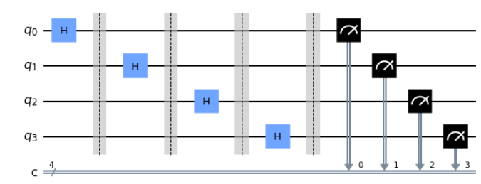

# QRandomNumber:

This code does the same thing as the classical function random.randint() that exist in python. Except for this time it was adapted to run on a Quantum Computer!

# How does it work:
First of all, we will generate a quantum circuit with "n" number of qubit. This "n" number is found by taking the square root of the wanted limit. 
Exemple: We want to generate numbers between 0 and 20. We will sqrt(20) and find 4. This is the number of qubit in the circuit. 

We then apply a Hadamard gate to every qubit and then measure them. 
The circuit will look like this: 

Once the circuit is generated, we will run the simulation on the qasm simulator which will return all binary output and their predictions:

Finally, we simply take the value with the highest prediction we convert the binary number to an integer. 
